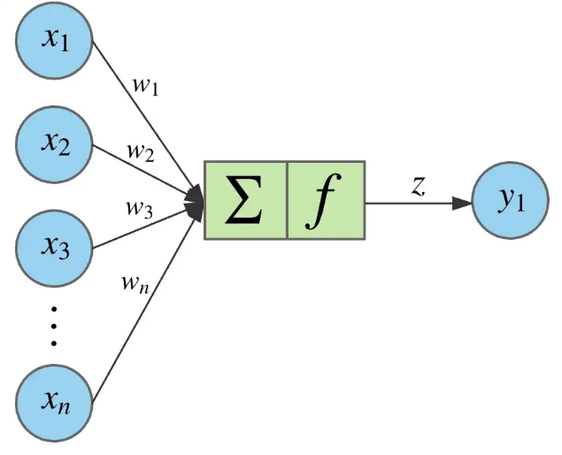
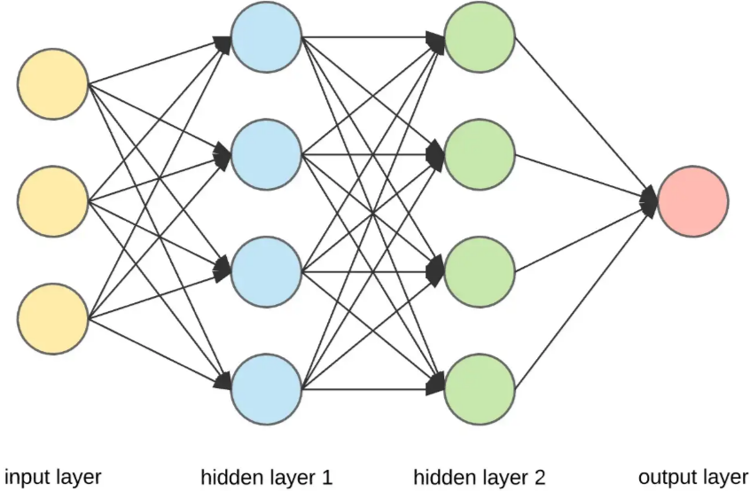

# Neuronale Netzwerke

Ein neuronales Netzwerk ist ein **mathematisches Modell**, das vom menschlichen Gehirn inspiriert ist. 
Es besteht aus miteinander verbundenen **Neuronen**, die ähnlich wie Nervenzellen zusammenarbeiten.
Das Netzwerk wird trainiert, indem es aus **Beispieldaten** lernt, Muster zu erkennen, und wird dadurch in der Lage, komplexe Probleme zu lösen.

## Einsatzgebiete

Neuronale Netzwerke finden in vielen Bereichen Anwendung. Hier ein paar Beispiele:

* **Computer Vision**
    * Informationen und Erkenntnisse aus Bildern / Videos gewinnen
        * Gesichtserkennung (z.B. in Smartphones)
        * Klassifizierung von handgeschriebenen Zahlen
        * Erkennung von Verkehrszeichen für selbstfahrende Autos

* **Spracherkennung**
    * Analyse menschlicher Sprache
        * Videos / Aufzeichnungen automatisch mit Untertiteln versehen
        * Gespräche in Textdokumente umwandeln (z.B. Meeting-Protokolle)
    * Verwendet von virtuellen Assistenten wie **Amazon Alexa** oder **Siri**

* **Natürliche Sprachverarbeitung (Natural Language Processing, NLP)**
    * Bedeutung und Erkenntnisse aus Texten extrahieren
        * Chatbots, die auf Kundenfragen antworten
        * Zusammenfassung von Dokumenten / Generieren von Artikeln

* **Empfehlungsmodule**
    * Persönliche Empfehlungen basierend auf Benutzeraktivitäten 
        * **Netflix** oder **Amazon Prime**

## Neuron

Ein **Neuron** ist die grundlegende Baueinheit eines neuronalen Netzwerks und entspricht in gewisser Weise einer Nervenzelle im menschlichen Gehirn. Es hat die Aufgabe, Eingabewerte zu verarbeiten, eine Berechnung durchzuführen und basierend auf dieser Berechnung ein Signal weiterzugeben. 
Ein Neuron besteht im Wesentlichen aus **einem einzigen Wert**, der als **Aktivierung** bezeichnet wird.

### Funktionsweise

1. **Eingaben empfangen**
    * Jedes Neuron empfängt Eingaben von anderen Neuronen / Eingabedaten des Netzwerks
    * Eingaben $x_i$ sind die Features einer Observation
        * Stellen die Werte dar, die das Neuron verarbeiten muss
    * Beispiel:
        * Bilder (28x28 Pixel) sollen klassifiziert werden
        * Jeder Pixel hat einen gewissen Farbwert, der dem Wert eines Neurons entspricht
        * Eingabeschicht hat also 784 Neuronen 

2. **Gewichte anwenden**
    * Jede Eingabe $x_i$ wird mit einem **Gewicht** $w_i$ multipliziert
    * Gewichte bestimmten die Wichtigkeit jeder Eingabe für das Neuron
        * Je höher dieses ist, desto mehr Einfluss hat die Eingabe auf das Ergebnis
    * Gewichtete Eingabewerte werden addiert:
        * $z = (w_1 \cdot x_1) + (w_2 \cdot x_2) + \dots + b$
    * Der **Bias b** passt das Ergebnis zusätzlich an und hilft, das Modell **flexibler** zu machen

3. **Aktivierungsfunktion anwenden**
    * Der zuvor berechnete Wert z wird durch eine **Aktivierungsfunktion** transformiert
    * Entscheidet, ob ein Neuron aktiviert wird
        * Ob Signal weitergeleitet wird oder nicht

4. **Signal weiterleiten**
    * Berechneter Wert wird weitergegeben, wenn Neuron durch die **Aktivierungsfunktion** aktiviert wird
    * Dieses dient als Eingabe für die Neuronen der nächsten Schicht

## Aufbau

Ein neuronales Netzwerk besteht aus mehreren Schichten, die zusammenarbeiten:

* **Eingabeschicht (Input Layer)**
    * Nimmt Rohdaten auf und schickt diese an die nächste Schicht weiter

* **Verborgene Schicht (Hidden Layer)**
    * Hier passiert die eigentliche Verarbeitung
    * Jedes Neuron empfängt Eingaben aus der vorherigen Schicht
        * Gewichtet diese und summiert sie
        * Ergebnis wird an die **Aktivierungsfunktion** weitergegeben

* **Ausgabeschicht (Output Layer)**
    * Liefert das endgültige Ergebnis des Netzwerks
    * Bei **Klassifikationen** hat die Ausgabeschicht normalerweise so viele Neuronen wie Klassen
        * Klassifikation von handgeschriebenen Ziffern (0-9) gibt es 10 Neuronen
    * Bei **Regressionsaufgaben** kann die Ausgabeschicht auch nur ein Neuron haben
        * Kontinuierlicher Wert - z.B. für Preisvorhersagen
    * Bei **mehrdimensionalen Ausgaben** können mehrere Neuronen in der Ausgabeschicht benötigt werden
        * Vorhersage mehrerer Werte

## Lernen 

Ein neuronales Netzwerk lernt durch den kontinuierlichen Anpassungsprozess der **Gewichte** und **Biases** 
basierend auf den Eingabedaten und der **Fehlerberechnung**. 
Das Lernen erfolgt in zwei Hauptphasen: **Forward Pass** und **Backpropagation**

1. **Forward Pass**
    * Vorhersage / Ausgabe wird berechnet indem Eingabedaten durch das Netzwerk geschickt werden
        * Durch Berechnung der Aktivierungen
        * Die einzelnen Gewichtungen werden anfangs random gesetzt
    * Ausgabe aus dem Forward Pass ist der **erste Versuch** des Netzwerks, eine Vorhersage zu treffen
    * Kann sich von der tatsächlichen Zielausgabe unterscheiden
    
2. **Fehlerberechnung (Loss Function)**
    * Nach dem Forward Pass wird der Fehler ermittelt
        * Differenz zwischen der **Vorhersage** und der tatsächlichen **Zielausgabe**
    * Fehlerberechnung erfolgt typischerweise durch eine **Loss Function**
        * z.B. Mean Squared Error (MSE) - Regression

3. **Backpropagation**
    * **Fehler**, der im Forward Pass berechnet wurde, wird **rückwärts durchs Netzwerk propagiert**
        * Die einzelnen **Gewichtungen** werden dabei angepasst
        * Ziel ist es, die Gewichte so zu ändern, dass der Fehler im nächsten Durchgang kleiner wird

4. **Wiederholung (Iterativer Lernprozess)**
    * Forward Pass und Backpropagation werden **mehrmals wiederholt**
    * Netzwerk wird mit verschiedenen Trainingsdaten konfrontiert
    * Fehler soll mit jeder Iteration minimiert werden durch die Anpassung der Gewichte
        * Netzwerk macht dadurch immer bessere Vorhersagen

