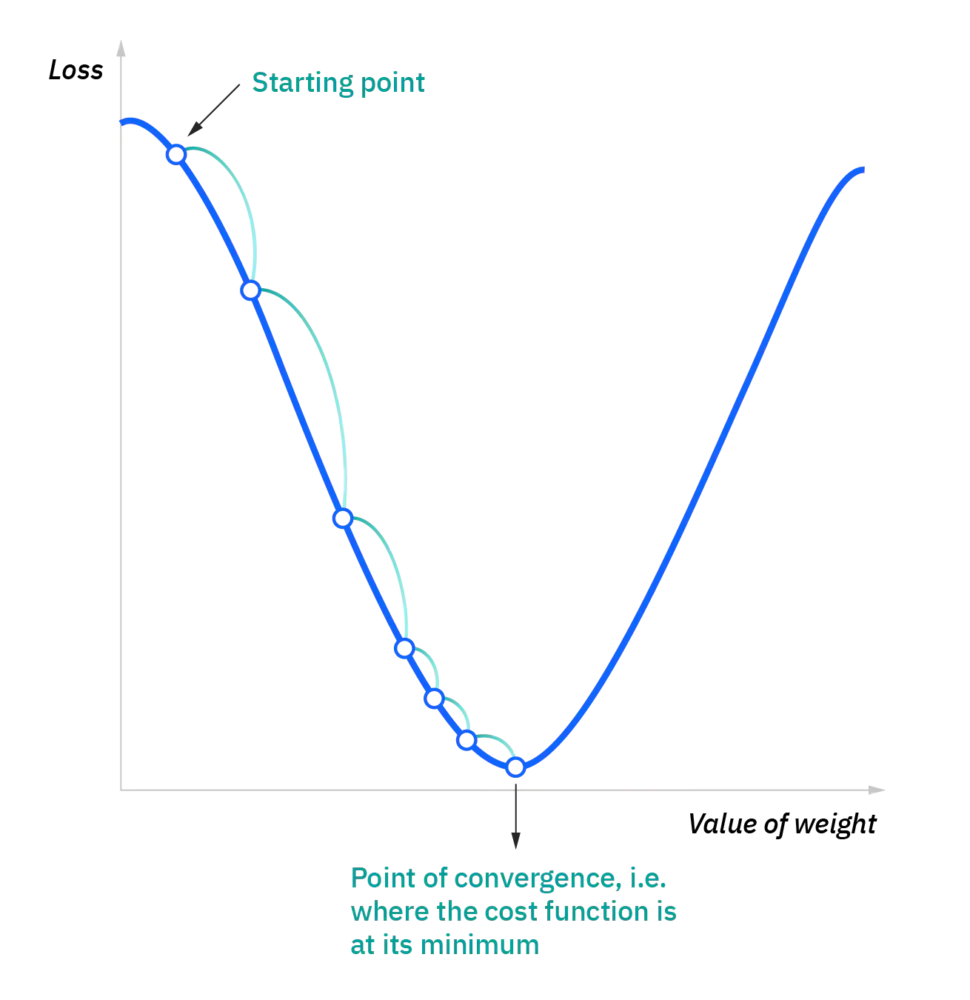
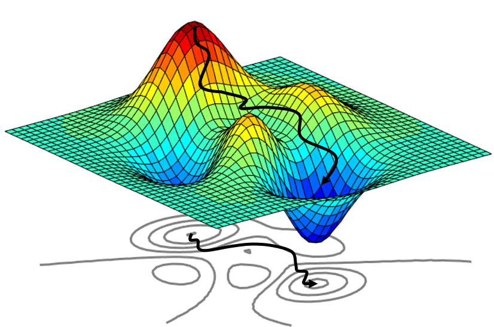
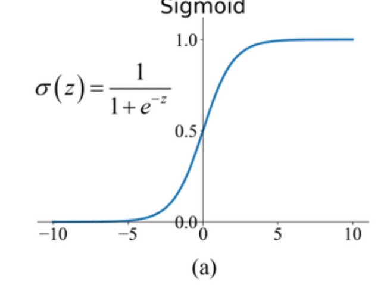
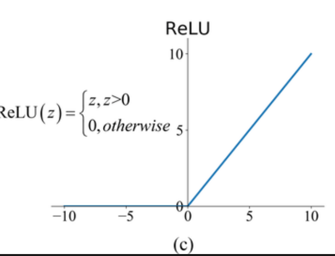

# Neuronale Netzwerke

Ein neuronales Netzwerk ist ein **mathematisches Modell**, das vom menschlichen Gehirn inspiriert ist. 
Es besteht aus miteinander verbundenen **Neuronen**, die ähnlich wie Nervenzellen zusammenarbeiten.
Das Netzwerk wird trainiert, indem es aus **Beispieldaten** lernt, Muster zu erkennen, und wird dadurch in der Lage, komplexe Probleme zu lösen.

## Einsatzgebiete

Neuronale Netzwerke finden in vielen Bereichen Anwendung. Hier ein paar Beispiele:

* **Computer Vision**
    * Informationen und Erkenntnisse aus Bildern / Videos gewinnen
        * Gesichtserkennung (z.B. in Smartphones)
        * Klassifizierung von handgeschriebenen Zahlen
        * Erkennung von Verkehrszeichen für selbstfahrende Autos

* **Spracherkennung**
    * Analyse menschlicher Sprache
        * Videos / Aufzeichnungen automatisch mit Untertiteln versehen
        * Gespräche in Textdokumente umwandeln (z.B. Meeting-Protokolle)
    * Verwendet von virtuellen Assistenten wie **Amazon Alexa** oder **Siri**

* **Natürliche Sprachverarbeitung (Natural Language Processing, NLP)**
    * Bedeutung und Erkenntnisse aus Texten extrahieren
        * Chatbots, die auf Kundenfragen antworten
        * Zusammenfassung von Dokumenten / Generieren von Artikeln

* **Empfehlungsmodule**
    * Persönliche Empfehlungen basierend auf Benutzeraktivitäten 
        * **Netflix** oder **Amazon Prime**

## Neuron

Ein **Neuron** ist die grundlegende Baueinheit eines neuronalen Netzwerks und entspricht in gewisser Weise einer Nervenzelle im menschlichen Gehirn. Es hat die Aufgabe, Eingabewerte zu verarbeiten, eine Berechnung durchzuführen und basierend auf dieser Berechnung ein Signal weiterzugeben. 
Ein Neuron besteht im Wesentlichen aus **einem einzigen Wert**, der als **Aktivierung** bezeichnet wird.

### Funktionsweise

1. **Eingaben empfangen**
    * Jedes Neuron empfängt Eingaben von anderen Neuronen / Eingabedaten des Netzwerks
    * Eingaben $x_i$ sind die Features einer Observation
        * Stellen die Werte dar, die das Neuron verarbeiten muss
    * Beispiel:
        * Bilder (28x28 Pixel) sollen klassifiziert werden
        * Jeder Pixel hat einen gewissen Farbwert, der dem Wert eines Neurons entspricht
        * Eingabeschicht hat also 784 Neuronen 

2. **Gewichte anwenden**
    * Jede Eingabe $x_i$ wird mit einem **Gewicht** $w_i$ multipliziert
    * Gewichte bestimmten die Wichtigkeit jeder Eingabe für das Neuron
        * Je höher dieses ist, desto mehr Einfluss hat die Eingabe auf das Ergebnis
    * Gewichtete Eingabewerte werden addiert:
        * $z = (w_1 \cdot x_1) + (w_2 \cdot x_2) + \dots + b$
    * Der **Bias b** passt das Ergebnis zusätzlich an und hilft, das Modell **flexibler** zu machen

3. **Aktivierungsfunktion anwenden**
    * Der zuvor berechnete Wert z wird durch eine **Aktivierungsfunktion** transformiert
    * Entscheidet, ob ein Neuron aktiviert wird
        * Ob Signal weitergeleitet wird oder nicht

4. **Signal weiterleiten**
    * Berechneter Wert wird weitergegeben, wenn Neuron durch die **Aktivierungsfunktion** aktiviert wird
    * Dieses dient als Eingabe für die Neuronen der nächsten Schicht

## Aufbau

Ein neuronales Netzwerk besteht aus mehreren Schichten, die zusammenarbeiten:

* **Eingabeschicht (Input Layer)**
    * Nimmt Rohdaten auf und schickt diese an die nächste Schicht weiter

* **Verborgene Schicht (Hidden Layer)**
    * Hier passiert die eigentliche Verarbeitung
    * Jedes Neuron empfängt Eingaben aus der vorherigen Schicht
        * Gewichtet diese und summiert sie
        * Ergebnis wird an die **Aktivierungsfunktion** weitergegeben

* **Ausgabeschicht (Output Layer)**
    * Liefert das endgültige Ergebnis des Netzwerks
    * Bei **Klassifikationen** hat die Ausgabeschicht normalerweise so viele Neuronen wie Klassen
        * Klassifikation von handgeschriebenen Ziffern (0-9) gibt es 10 Neuronen
    * Bei **Regressionsaufgaben** kann die Ausgabeschicht auch nur ein Neuron haben
        * Kontinuierlicher Wert - z.B. für Preisvorhersagen
    * Bei **mehrdimensionalen Ausgaben** können mehrere Neuronen in der Ausgabeschicht benötigt werden
        * Vorhersage mehrerer Werte

 

  

Das Hinzufügen mehrerer **Hidden Layers** ermöglicht es dem neuronalen Netzwerk, komplexere Aufgaben zu lösen und 
abstraktere Muster zu erkennen. Man bezeichnet dies oft als **Deep Neural Network (DNNs)**, da sie hochkomplexe Probleme lösen können, die einfache Netzwerke mit wenigen Schichten nicht bewältigen können.

Jede zusätzliche Schicht erhöht die Anzahl der Berechnungen, da mehr Neuronen aktiviert werden müssen. Dies führt zu **längeren Trainingszeiten** und **höheren Speicheranforderungen**.

Mehr Schichten bedeuten auch mehr Parameter (Gewichte und Biases), was die **Gefahr von Overfitting erhöht**. 
Dabei passt sich das Modell zu stark an die Trainingsdaten an und liefert schlechte Ergebnisse bei neuen Daten.
Um diesem Problem entgegenzuwirken verwendet man Techniken wie **Regularisierung**, **Dropout** oder **mehr Trainingsdaten**.

## Training

Ein neuronales Netzwerk lernt durch den kontinuierlichen Anpassungsprozess der **Gewichte** und **Biases** 
basierend auf den Eingabedaten und der **Fehlerberechnung**. 
Das Lernen erfolgt in zwei Hauptphasen: **Forward Pass** und **Backpropagation**

1. **Forward Pass**
    * Vorhersage / Ausgabe wird berechnet indem Eingabedaten durch das Netzwerk geschickt werden
        * Durch Berechnung der Aktivierungen
        * Die einzelnen Gewichtungen werden anfangs random gesetzt
    * Ausgabe aus dem Forward Pass ist der **erste Versuch** des Netzwerks, eine Vorhersage zu treffen
    * Kann sich von der tatsächlichen Zielausgabe unterscheiden
    
2. **Fehlerberechnung (Loss Function)**
    * Nach dem Forward Pass wird der Fehler ermittelt
        * Differenz zwischen der **Vorhersage** und der tatsächlichen **Zielausgabe**
    * Fehlerberechnung erfolgt typischerweise durch eine **Loss Function**
        * z.B. Mean Squared Error (MSE) - Regression

3. **Backpropagation**
    * **Fehler**, der im Forward Pass berechnet wurde, wird **rückwärts durchs Netzwerk propagiert**
        * Die einzelnen **Gewichtungen** werden dabei angepasst
        * Ziel ist es, die Gewichte so zu ändern, dass der Fehler im nächsten Durchgang kleiner wird

4. **Wiederholung (Iterativer Lernprozess)**
    * Forward Pass und Backpropagation werden **mehrmals wiederholt**
    * Netzwerk wird mit verschiedenen Trainingsdaten konfrontiert
    * Fehler soll mit jeder Iteration minimiert werden durch die Anpassung der Gewichte
        * Netzwerk macht dadurch immer bessere Vorhersagen

### Forward Pass

$ \text{out} = f(b + \sum_i x_i \cdot w_i) = f(b + x \cdot w^T) $

$x_i$ ... **Eingabewerte** für das neuronale Netzwerk  
$w_i$ ... **Gewichte**, die bestimmen, wie stark jeder Eingabewert in die Berechnung des Outputs einfließt  
$b$ ... **Bias** wird hinzugefügt, um eine Verschiebung in den Vorhersagen zu ermöglichen (Flexibilität)  
$\sum_i x_i \cdot w_i$ ... **gewichtete Summe** der Eingabewerte $x_i$ (Linearkombination)  
$x \cdot w^T$ ... Dasselbe wie darüber mit der Summe in Vektorform, $w^T$ ist der transponierte Vektor der Gewichte  
$f$... **Aktivierungsfunktion**, die auf die berechnete Summe angewendet wird (kann sich je nach Modell unterscheiden)

### Backpropagation

Diese Formel ist ein grundlegender Ausdrück für die **Gewichtsaktualisierung** in einem **Gradient Descent**-Verfahren, das auch in der **Backpropagation** verwendet wird, um die Gewichte eines neuronalen Netzwerks zu optimieren. 

Hierbei werden die **Gewichte in die entgegengesetzte Richtung des Gradienten verschoben** (deswegen das Minuszeichen), um den Fehler zu minimieren und sich der optimalen Lösung anzunähern.

$w_{t+1} = w_t - \eta \frac{\partial L}{\partial w_t}$ 

$w_t$ ... **Gewichte** des Modells zum Zeitpunkt t in der aktuellen Iteration  
$w_{t+1}$ ... **Gewichte** des Modells in der nächsten Iteration t + 1, nachdem sie aktualisiert wurden  
$\eta$ ... **Lernrate**, gibt an, wie groß der Schritt bei der Gewichtsaktualisierung ist (zu große Lernrate kann dazu führen, dass das Modell die optimale Lösung überspringt)  
$\frac{\partial L}{\partial w_t}$ ... **Ableitung der Verlustfunktion L** nach den Gewichten $w_t$. Der Gradient gibt an, in welche Richtung die Gewichte angepasst werden müssen, um den Fehler zu minimieren.

### Gradient Descent

Bei **Gradient Descent** handelt es sich um einen Optimierungsalgorithmus, der eine zentralle Rolle im Training von neuronalen Netzwerken spielt. Er wird verwendet, um die **Gewichte** und **Biases** des Netzwerks zu aktualisieren, um die **Fehler** (Loss) zu minimieren und so die **Vorhersagegenauigkeit** zu **verbessern**. 

* Positiver Gradient
    * Gewicht muss reduziert werden
* Negativer Gradient
    * Gewicht muss erhöht werden

#### Funktionsweise

* **Berechnung des Gradienten**
    * Gibt Richtung und Stärke an, in die das Gewicht angepasst werden muss
        * Gibt die Richtung an, in der der Fehler zunimmt
    * Aus Fehlerberechnung und Ableitung der Loss-Funktion in Bezug auf die Gewichte

* **Gewichtsaktualisierung**
    * Gewichte und Biases werden in die entgegengesetzte Richtung des Gradienten verschoben

* **Schrittgröße**
    * Anpassung erfolgt in kleinen Schritten
    * Bestimmt durch die **Lernrate**

### Batch Size

* Bestimmt, wie viele Eingabedaten durchs Netzwerk geleitet werden bevor Gewichte aktualisiert werden
* Beeinflusst **Geschwindigkeit** und **Genauigkeit** des Lernprozesses

Die Batch Size beeinflusst das Training auf verschiedene Weise:

1. **Kleinere Batch-Größe**
    * Vorteile:
        * Schnellere Aktualisierung der Gewichte (häufige Anpassungen)
        * Bessere Generalisierung möglich
            * Wahrscheinlichkeit von Overfitting wird verringert
    * Nachteile:
        * Größere Schwankung des Fehlerwerts möglich
            * Gradientabstieg ist weniger stabil

2. **Größere Batch-Größe**
    * Vorteile:
        * Stabilere und genauere Schätzungen des Gradienten
            * Mehr Daten werden in einem Schritt verarbeitet
            * Stabilere Konvergenz
    * Nachteile:
        * Längere Trainingszeiten
        * Schlechtere Generalisierung

### Adam

Adam (Adaptive Moment Estimation) ist eine erweiterte Version des Gradient Descent-Algorithmus, die bei der
Aktualisierung der Gewichte sowohl die **erste Momentabschätzung** (Mittelwert des Gradienten) als auch die **zweite Momentabschätzung** (Unschärfe / Varianz der Gradienten) berücksichtigt.
Dieser Ansatz passt die **Lernrate individuell für jedes Gewicht** an, basierend auf den Momentabschätzungen, was zu einer **schnelleren und stabileren Konvergenz** führt.

Adam eignet sich besonders für **nicht-stationäre Probleme**, bei denen die Gradienten stark variieren können, und ist daher eine häufig verwendete Methode in neuronalen Netzwerken.

### Regularisierung

## Aktivierungsfunktionen

Die Aktivierungsfunktion sorgt dafür, dass das Modell **nicht nur lineare Zusammenhänge** lernt, sondern auch komplexe, nicht-lineare Beziehungen.
Jede Schicht fügt eine neue, nicht-lineare Transformation hinzu, wodurch das neuronale Netz viel leistungsfähiger wird.

Diese Funktionen bestimmen, wie die Ausgaben von Neuronen transformiert werden, bevor sie an die nächste Schicht weitergegeben werden.

### **Sigmoid**

Die **Sigmoid-Funktion** ist eine Aktivierungsfunktion, die eine **S-Kurve (Sigmoidkurve)** beschreibt.
Sie nimmt als Eingabe eine beliebige reelle Zahl und gibt einen Wert zwischen 0 und 1 zurück. 
Die Funktion wird häufig verwendet, um Werte in **Wahrscheinlichkeiten** umzuwandeln.

  

**Eigenschaften der Sigmoid-Funktion:**

* Ausgabe im Bereich [0, 1]
    * Alle Werte werden auf diesen Bereich beschränkt
    * Ideal für Wahrscheinlichkeitsberechnungen
* Glatt und kontinuierlich
    * Ableitung existiert überall
    * Für Optimierungsverfahren wie den Gradientenabstieg geeignet

**Anwendungsgebiete:**
* Binärklassifikation
    * Ausgabe einer Wahrscheinlichkeit darstellen
        * z.B. ob ein Bild eine Katze zeigt (1) oder nicht (0)
    * Meist in Kombination mit der **Binary Cross-Entropy-Loss-Funktion**
        * Abweichung der Vorhersagen von den tatsächlichen Klassen zu minimieren
* Reinforcement Learning
    * Wahrscheinlichkeit bestimmen, mit der eine bestimmte Aktion ausgeführt wird

**Vorteile:**
* Beliebige Eingaben werden in einen Bereich zwischen 0 und 1 umgewandelt
* Einfach und leicht zu implementieren

**Nachteile:**
* Vanishing Gradient Problem
    * Für sehr große / kleine Werte von x wird die Ableitung sehr kleine
    * Erschwert das Training bei tiefen neuronalen Netzen erschwert
* Langsame Konvergenz im Vergleich zu modernen Aktivierungsfunktionen wie ReLU

### **ReLU**

Die **ReLU-Aktivierungsfunktion** ist heutzutage eine der beliebtesten und weit verbreitesten Funktionen in tiefen neuronalen Netzwerken. Sie wird durch die folgende Formel definiert:

$f(x) = max(0, x)$

Das bedeutet:
* Wenn **x <= 0**, gibt ReLU **0** zurück
* Wenn **x > 0**, gibt ReLU den Wert **x** unverändert zurück

Diese einfache FUnktion führt zu leistungsfähigen neuronalen Netzen und hat in vielen **Deep-Learning-Anwendungen** die Sigmoid- und
Tanh-Funktionen abgelöst.

**Vorteile:**
* Effiziente Berechnung
    * Einfacher zu berechnen als Sigmoid oder Tanh
* Schnellere Konvergenz
    * Netzwerke mit ReLU konvergieren schnelleren
    * Vanishing gradient wird weitgehend vermieden
* Verbesserter Gradientendurchfluss
    * Größere Gradientenwerte im Vergleich zu Sigmoid
    * Lernen in tiefen Netzen wird verbessert

**Nachteile:**
* Dead Neurons
    * Ist die Eingabe immer negativ, gibt es ständig 0 aus
    * Das Neuron lernt dadurch nichts mehr und bleibt dauerhaft inaktiv
* Unbeschränkte Ausgabewerte
    * Höhere Aktivierungen möglich, die zu Instabilitäten führen können

### Softmax

Die **Softmax-Funktion** wird hauptsächlich in neuronalen Netzen für **Mehrklassen-Klassifikationsprobleme** verwendet.
Sie transformiert die Rohwerte eines neuronalen Netzwerks in **Wahrscheinlichkeiten**, die alle zusammen 1 ergeben.
Jede Ausgabe stellt die Wahrscheinlichkeit dar, dass die Eingabe zu einer bestimmten Klasse gehört.

### Keine Aktivierungsfunktion

Es gibt Netzwerke, bei denen keine Aktivierungsfunktionen eingesetzt werden. Allerdings werden diese selten verwendet, da sie keine
komplexen, nicht-linearen Muster lernen können. 

Ein einfaches neuronales Netz ohne Aktivierungsfunktion im Output-Layer (und mit MSELoss) entspricht der klassischen **linearen Regression**.